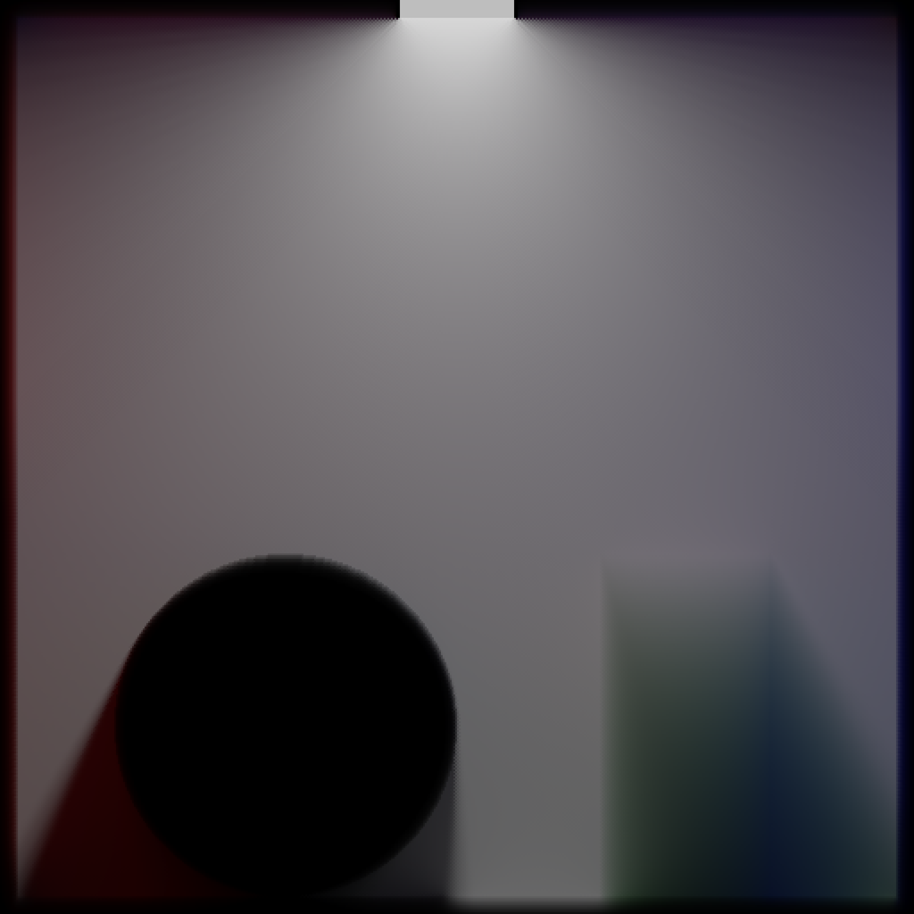
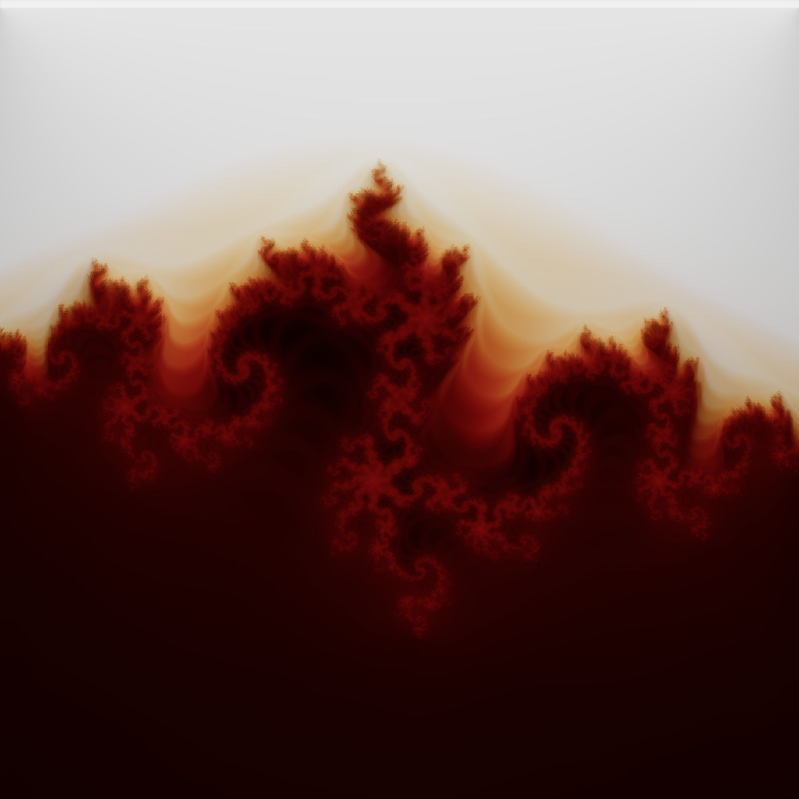
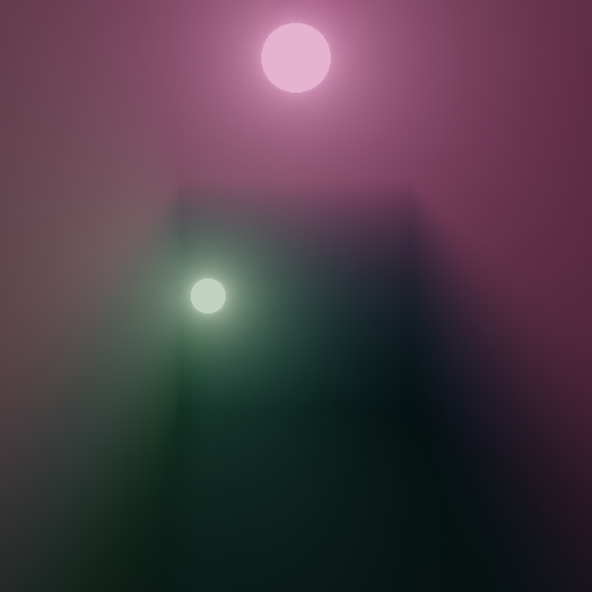
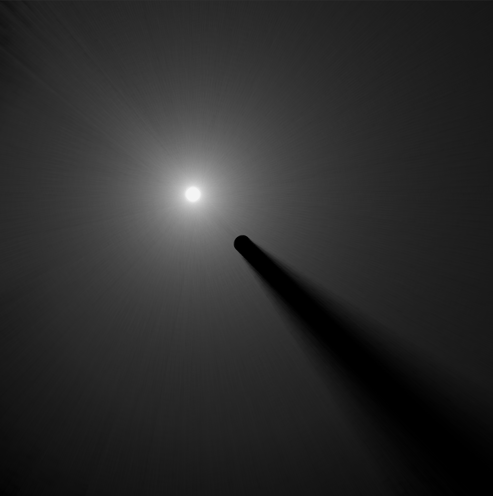
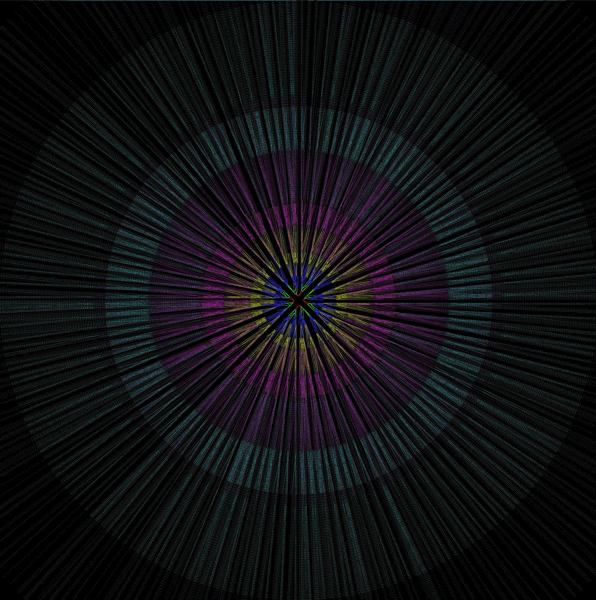

# Amitabha: Reference Implementation of Holographic Radiance Cascades

This repository contains a sample implementation of [Holographic Radiance Cascades](https://arxiv.org/abs/2505.02041) (HRC), a variant of [Radiance Cascades](https://radiance-cascades.com/) which can accurately resolve hard shadows and volumetrics with no added cost.

Other implementations:
* [Yaazarai/Volumetric-HRC](https://github.com/Yaazarai/Volumetric-HRC): A full implementation by Yaazarai in Game Maker, which uses textures for storage. Has an explanation of HRC which is less technical than the paper.
* [Nihil](https://github.com/entropylost/nihil): Implementation of HRC on the CPU treating lines as continuous functions which are bilinearly discretized. Has some useful volumetric DDA code and is quite simple, but has low quality and performance.
* [Shadertoy by Suslik](https://www.shadertoy.com/view/4ctczl): Web demo of HRC. Inefficient merging, and no extensions.

## Gallery

<table align="center">
    <tr>
    <td align="center"></td>
    <td align="center"></td>
    </tr>
    <tr>
    <td align="center"></td>
    <td align="center"></td>
    </tr>
    <tr>
</table>

---

[Radial HRC](https://github.com/entropylost/amitabha/blob/radial/src/main.rs) was an old implementation that used one grid per direction in order to test the hypothesis that RC could resolve sharp shadows so long as the probe spacing perpendicular to the rays was small at all levels.

<table>
    <td align="center"></td>
    <td align="center"></td>
</table>

---

Join the [Radiance Cascades Discord](https://discord.gg/EF9JfcEJPd) for more information and to discuss the algorithm!
